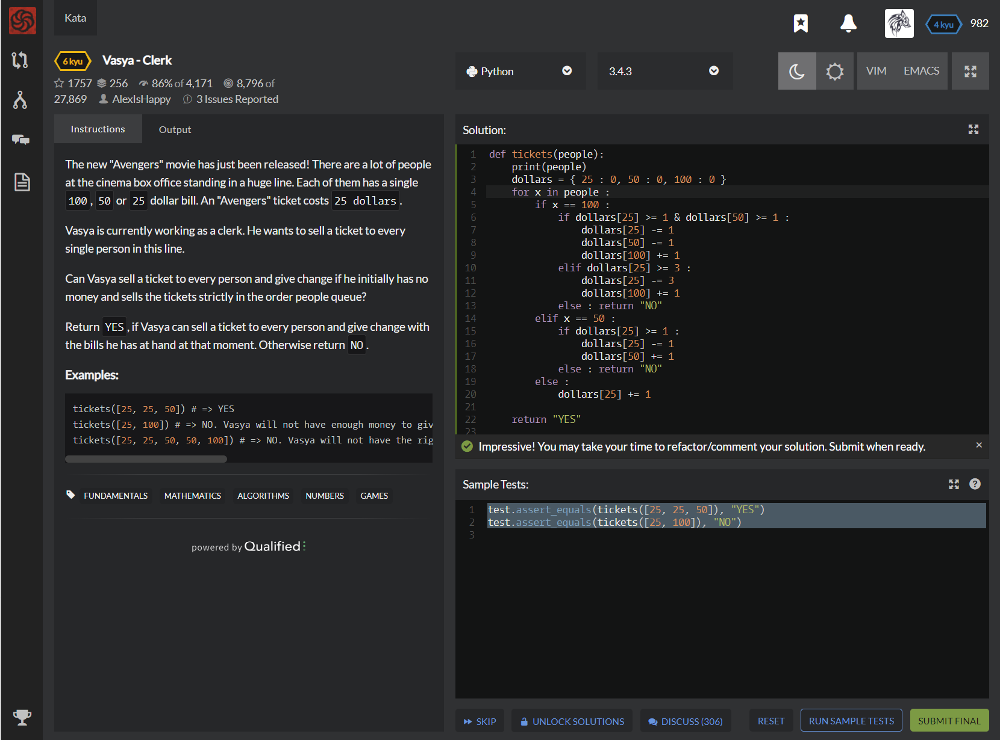

# [[6 Kyu] Vasya - Clerk](https://www.codewars.com/kata/555615a77ebc7c2c8a0000b8/train/python)




## Instructions

### Task

The new "Avengers" movie has just been released! There are a lot of people at the cinema box office standing in a huge line. Each of them has a single `100`, `50` or `25` dollar bill. An "Avengers" ticket costs `25 dollars`.

Vasya is currently working as a clerk. He wants to sell a ticket to every single person in this line.

Can Vasya sell a ticket to every person and give change if he initially has no money and sells the tickets strictly in the order people queue?

Return `YES`, if Vasya can sell a ticket to every person and give change with the bills he has at hand at that moment. Otherwise return `NO`.

### Examples

```python
tickets([25, 25, 50]) # => YES 
tickets([25, 100]) # => NO. Vasya will not have enough money to give change to 100 dollars
tickets([25, 25, 50, 50, 100]) # => NO. Vasya will not have the right bills to give 75 dollars of change (you can't make two bills of 25 from one of 50)
```


## Sample Test

```python
test.assert_equals(tickets([25, 25, 50]), "YES")
test.assert_equals(tickets([25, 100]), "NO")
```


## My solution

```python
def tickets(people):
    print(people)
    dollars = { 25 : 0, 50 : 0, 100 : 0 }
    for x in people :
        if x == 100 :
            if dollars[25] >= 1 & dollars[50] >= 1 : 
                dollars[25] -= 1
                dollars[50] -= 1
                dollars[100] += 1
            elif dollars[25] >= 3 : 
                dollars[25] -= 3
                dollars[100] += 1
            else : return "NO"
        elif x == 50 :
            if dollars[25] >= 1 : 
                dollars[25] -= 1
                dollars[50] += 1
            else : return "NO"
        else : 
            dollars[25] += 1

    return "YES"

```


## Test Results

Test Passed

Test Passed

Test Passed

You have passed all of the tests! :)

---------

Time: 831ms Passed: 19 Failed: 0


## Best Solution

```python
def tickets(a):
    n25 = n50 = n100 = 0
    for e in a:
        if   e==25            : n25+=1
        elif e==50            : n25-=1; n50+=1
        elif e==100 and n50>0 : n25-=1; n50-=1
        elif e==100 and n50==0: n25-=3
        if n25<0 or n50<0:
            return 'NO'
    return 'YES'
```


## The things I got

