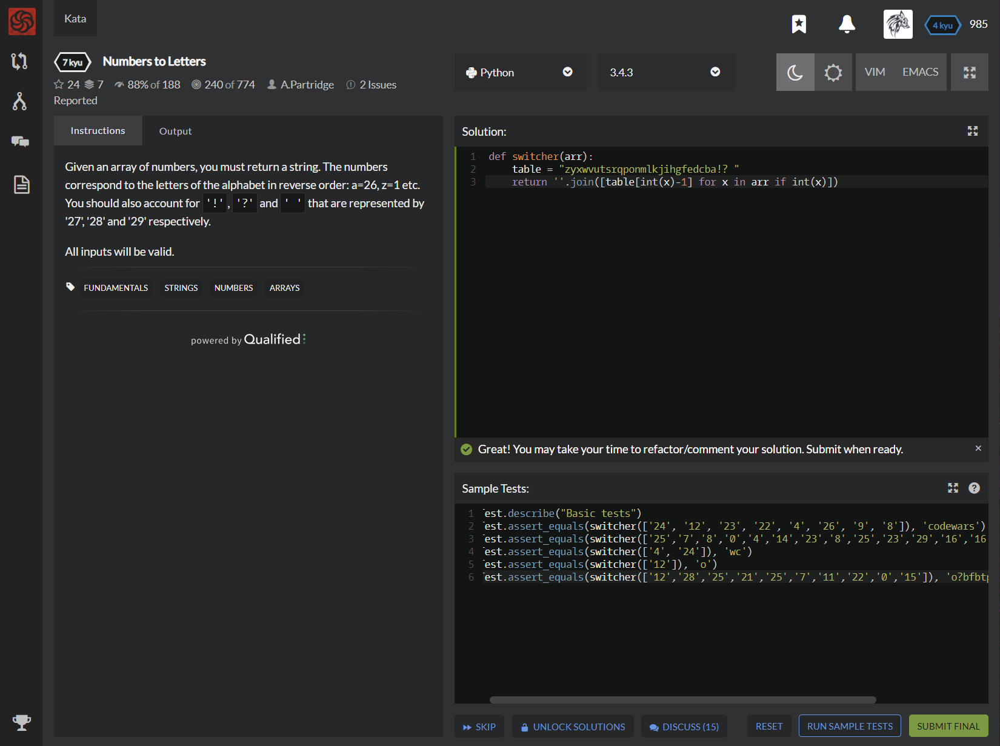

# [[7 Kyu] Numbers to Letters](https://www.codewars.com/kata/57ebaa8f7b45ef590c00000c/train/python)




## Instructions

Given an array of numbers, you must return a string. The numbers correspond to the letters of the alphabet in reverse order: a=26, z=1 etc. You should also account for `'!'`, `'?'` and `' '` that are represented by '27', '28' and '29' respectively.

All inputs will be valid.


## Sample Test

```python
Test.describe("Basic tests")
Test.assert_equals(switcher(['24', '12', '23', '22', '4', '26', '9', '8']), 'codewars')
Test.assert_equals(switcher(['25','7','8','0','4','14','23','8','25','23','29','16','16','4']), 'btswmdsbd kkw')
Test.assert_equals(switcher(['4', '24']), 'wc')
Test.assert_equals(switcher(['12']), 'o')
Test.assert_equals(switcher(['12','28','25','21','25','7','11','22','0','15']), 'o?bfbtpel' )
```


## My solution

```python
def switcher(arr):
    table = "zyxwvutsrqponmlkjihgfedcba!? "
    return ''.join([table[int(x)-1] for x in arr if int(x)])
```


## Test Results

Test Passed

Test Passed

Test Passed

You have passed all of the tests! :)

---------

Time: 797ms Passed: 45 Failed: 0


## Best Solution

```python
def switcher(arr):
    d = {str(i): chr(123-i) for i in range(1,27)}
    d.update({'27':'!'})
    d.update({'28':'?'})
    d.update({'29':' '})
    d.update({'0':''})
    return ''.join([d[str(i)] for i in arr])
```


## The things I got

