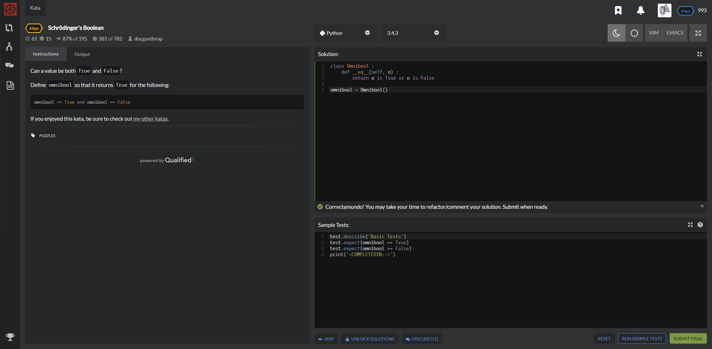

# [[6 Kyu] Schrödinger's Boolean](https://www.codewars.com/kata/schrodingers-boolean/train/python)




## Instructions

### Task

Can a value be both `True` and `False`?

Define `omnibool` so that it returns `True` for the following:

```python
omnibool == True and omnibool == False
```


## Sample Test

```python
test.describe('Basic Tests')
test.expect(omnibool == True)
test.expect(omnibool == False)
print('<COMPLETEDIN::>')
```


## My solution

```python
class Omnibool :
    def __eq__(self, o) :
        return o is True or o is False

omnibool = Omnibool()
```


## Test Results

Test Passed

Test Passed

Test Passed

You have passed all of the tests! :)

---------

Time: 831ms Passed: 19 Failed: 0


## Best Solution

```python
same
```


## The things I got

