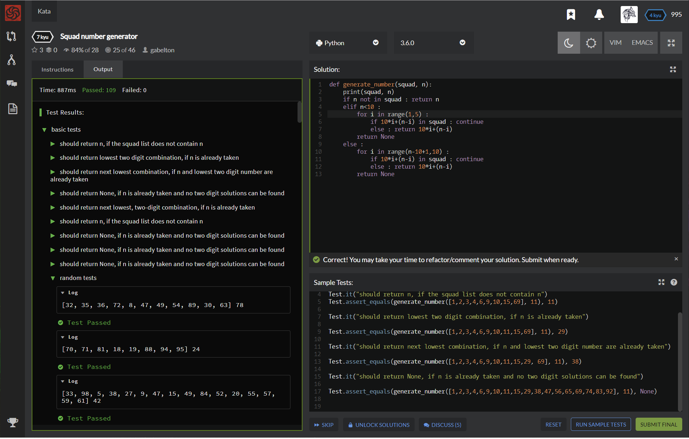

# [[7 Kyu] Squad number generator](https://www.codewars.com/kata/5d62961d18198b000e2f22b3/train/python)




## Instructions

At the start of each season, every player in a football team is assigned their own unique squad number. Due to superstition or their history certain numbers are more desirable than others.

Write a function generateNumber() that takes two arguments, an array of the current squad numbers (squad) and the new player's desired number (n). If the new player's desired number is not already taken, return n, else if the desired number can be formed by adding two digits between 1 and 9, return the number formed by joining these two digits together. E.g. If 2 is taken, return 11 because 1 + 1 = 2. Otherwise return null.

Note: Often there will be several different ways to form a replacement number. In these cases the number with lowest first digit should be given priority. E.g. If n = 15, but squad already contains 15, return 69, not 78.


## Sample Test

```python

Test.describe("generate_number")

Test.it("should return n, if the squad list does not contain n")
Test.assert_equals(generate_number([1,2,3,4,6,9,10,15,69], 11), 11)

Test.it("should return lowest two digit combination, if n is already taken")

Test.assert_equals(generate_number([1,2,3,4,6,9,10,11,15,69], 11), 29)

Test.it("should return next lowest combination, if n and lowest two digit number are already taken")

Test.assert_equals(generate_number([1,2,3,4,6,9,10,11,15,29, 69], 11), 38)

Test.it("should return None, if n is already taken and no two digit solutions can be found")

Test.assert_equals(generate_number([1,2,3,4,6,9,10,11,15,29,38,47,56,65,69,74,83,92], 11), None)


```


## My solution

```python
def generate_number(squad, n):
    print(squad, n)
    if n not in squad : return n
    elif n<10 : 
        for i in range(1,5) :
            if 10*i+(n-i) in squad : continue
            else : return 10*i+(n-i)
        return None
    else :
        for i in range(n-10+1,10) :
            if 10*i+(n-i) in squad : continue
            else : return 10*i+(n-i)
        return None
```


## Test Results

Test Passed

Test Passed

Test Passed

You have passed all of the tests! :)

---------

Time: 887ms Passed: 109 Failed: 0


## Best Solution

```python
def generate_number(squad, n):
    if n not in squad: return n
    for i in range(1, 10):
        for j in range(1, 10):
            if i + j == n and i * 10 + j not in squad:
                return i * 10 + j
```


## The things I got

