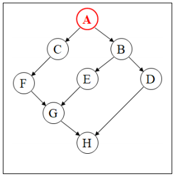
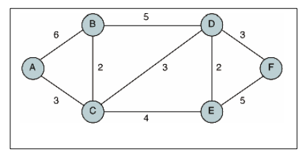

# [Data Structure HW #6]

### Introduction

Implement the following problems by C programming and upload only the source code files (such as xxx.c and xxx.h) as a zip file compressed to the homework board at abeek.knu.ac.kr.
Subject : [DS HW #6] StudentID_Name
a Zip File Attached : StudentID_Name.zip  

아래 1, 2, 3, 4 는 모두 코드가 나와야 함.
You should submit the codes corresponding to the following problems 1, 2, 3, 4

### Contents

**Graph1 :** 

**Graph2 :** 

1. Graph 를 (1) adjacency matrix 와 (2) adjacency list 를 이용하여 구현하시오. 이 구현한 부분을 이후 문제에서는 활용할 것.
Implement the Graphs using (1) adjacency matrix and (2) adjacency list. These graphs should be utilized at the following problems.

2. 다음과 같은 그래프 데이터를 파일로 입력받아, 1의 (1) (2)의 Graph 에 저장한 후, Depth-first traversal로 출력하시오. 또한, Breath-first traversal 로도 출력하시오.
Get a file with graph data, store it to the graphs implemented in 1 (1) and 1 (2). Print out the graphs by Depthfirst traversal and by Breath-first traversal.
Input File Example: // The starting point : A
A
A C
A B
B E
B D
C F
E G
F G
G H
D HAn Example of Print Out :
Depth-first traversal : A C F G H B E D
Breath-first traversal : A B C E D F G H

3. 1 (2)의 adjacency list에 그래프의 가중치를 추가하여 구현하시오.
  Modify the graph implemented in 1 (2) so that its adjacency list has weight.

4. 3에서 구현된 그래프를 이용하여, 다음과 같은 그래프 데이터를 파일로 입력받아, (1) minimum spanning tree와 (2) Dijkstra’s algorithm으로 shortest path를 구하시오.
  Using the graph structure implemented in 3, get a file with graph data and print out the shortest path by (1) minimum spanning tree, and (2) Dijkstra’s algorithm.
  Input File Example: // The starting point : A
  A
  A B 6
  B A 6
  A C 3
  C A 3
  B C 2
  C B 2
  B D 5
  D B 5
  C D 3
  D C 3
  C E 4
  E C 4
  D E 2
  E D 2
  D F 3
  F D 3
  E F 5
  F E 5

  

  An example of print out:

  

  Minimum spanning tree : 
  A C
  C B
  C D
  D E
  D F
  Shortest path from A : A B 5
  A C 3
  A D 6
  A E 7
  A F 9
